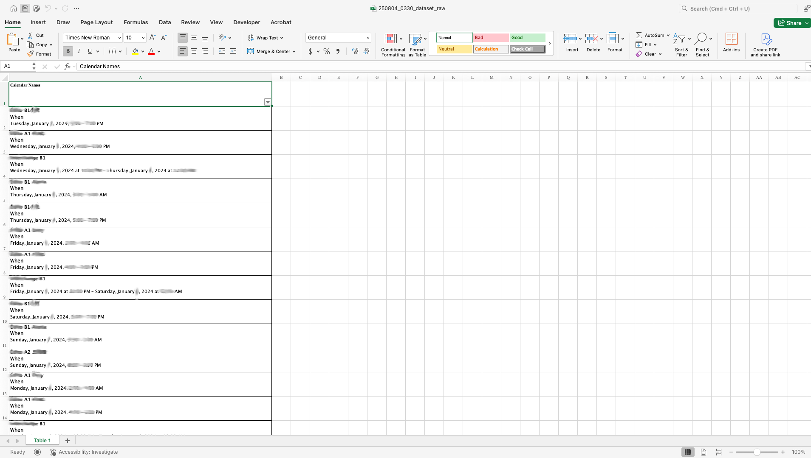
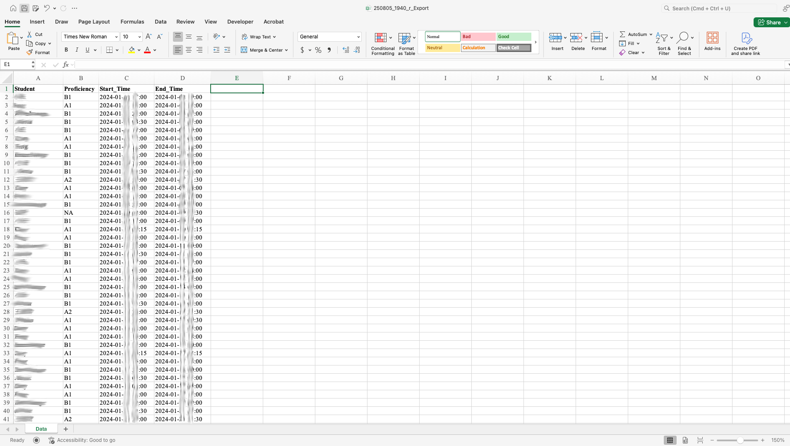
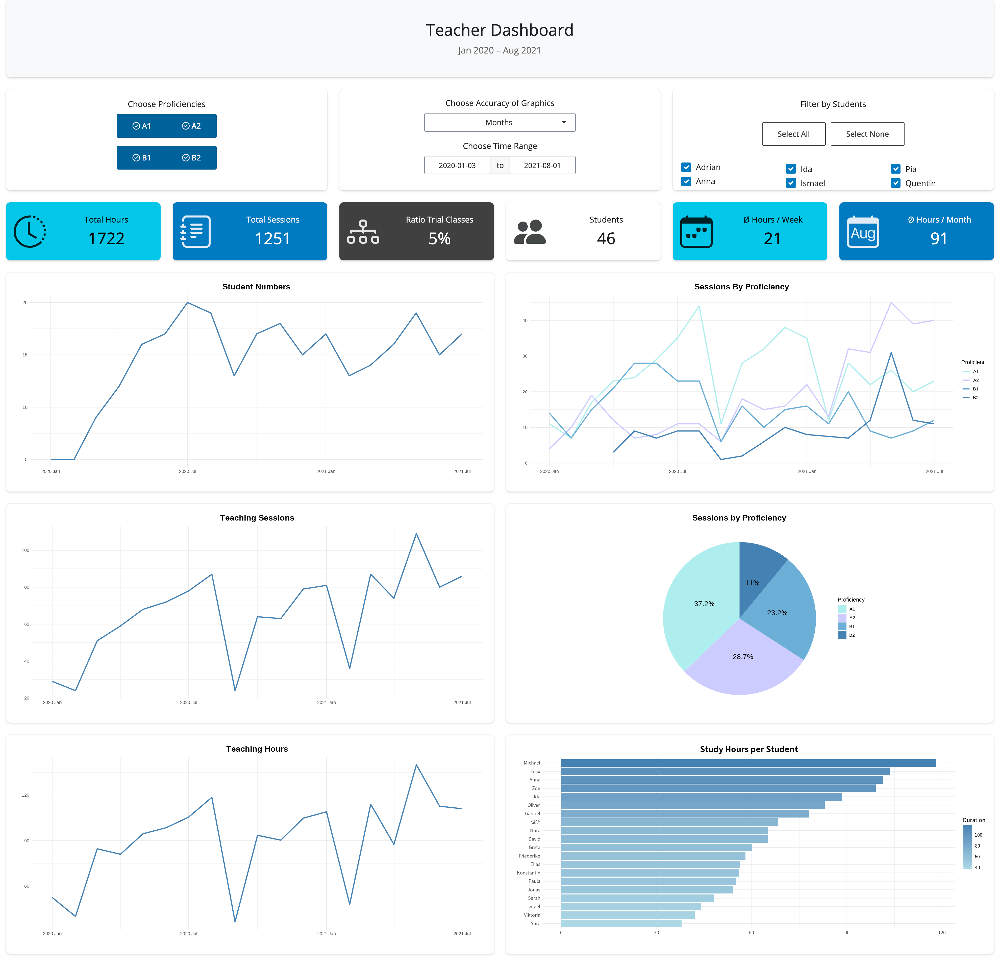

# 1 Goal and Motivation

The primary goal of this project is to empower teachers by providing an interactive dashboard that transforms raw teaching schedule data into meaningful insights. By enabling easy access to key performance indicators and flexible data visualizations, the dashboard supports data-driven decision-making and improves the understanding of student proficiencies and teaching patterns.

The motivation behind this project stems from the observation that valuable teaching data is often collected but rarely utilized effectively. By developing this dashboard, I aim to bridge the gap between data collection and practical application, making it accessible even for users without advanced data analysis skills.

Additionally, this project allowed me to apply and expand my skills in data cleaning, database management, and reactive web application development using R and Shiny, reinforcing my capabilities in end-to-end data analytics workflows.

# 2 Background / Introduction

After completing the Google Data Analytics Certificate, I had the great opportunity to start my first project working with real, unfiltered data.  
I gained access to a teacher’s calendar, where teachers recorded student names, proficiency levels, and class start and end times.  

Since the teacher had never utilized this data, I decided to develop a dashboard application that enables the teacher to gain insights and perform their own analyses using prepared filter options.  

For a more detailed introduction, please refer to the Readme file.

# 3 Data Preparation (MS Excel / SQL / R)
## 3.1 Data Collection

This step proved to be quite challenging.  
The data originated from Google Calendar and was exported in the `.ics` format.  

Typical tools for converting `.ics` files to `.csv` or `.xlsx` did not work correctly because recurring events were missing.  

To solve this, I imported the `.ics` file into the mail application **Thunderbird**, exported it as a PDF, and then used **Adobe Acrobat Pro** to convert the PDF into an `.xlsx` file.  

Below is a screenshot of the resulting `.xlsx` file after this process:



## 3.2 Data Cleaning
### 3.2.1 The 5 Main Problems

The dataset contained 1,824 rows.  
I encountered the following issues:  

- All event information was stored within a single cell.  
- Proficiencies were mixed with student names, without any clear system.  
- Personal events were included in the data.  
- Dates appeared in three different formats.  
- General inconsistencies throughout the dataset.

### 3.2.2 Every Event Information Inside One Cell

I used the formula `=TEXTSPLIT(A15, CHAR(10))` to split the text at every line break.  
This separated the data into three columns: Student Names/Proficiencies, the word “when,” and dates.  
I then deleted the column containing “when” immediately afterward.


### 3.2.3 Proficiencies Mixed with Student Names

To separate the proficiencies, I used Excel functions to search for specific proficiency levels within the text.  
If Excel found a match, it would write the proficiency into a new cell.  

Although the student names remained somewhat messy, this approach helped me filter out the proficiencies effectively.  

Here are some of the formulas I used:  

```excel
=IF(ISNUMBER(SEARCH("A1", A15)), "A1", "")
=IF(ISNUMBER(SEARCH("A2", A15)), "A2", "")
=IF(ISNUMBER(SEARCH("B1", A15)), "B1", "")
=IF(ISNUMBER(SEARCH("B2", A15)), "B2", "")
```

### 3.2.4 Personal Events Included in the Data

Personal events did not have any associated proficiency levels.  
Since all proficiencies were consolidated into a single column, I was able to filter for blank cells and manually delete these personal events with ease.  
Performing the deletion manually ensured that no actual class data was accidentally removed.

### 3.2.5 Dates Generated in Three Formats

The dates appeared in three different formats:  

- **Normal format:**  
  Tuesday, January 15, 2025, 15:00 – 16:00 PM  
- **Switch from AM to PM:**  
  Tuesday, January 15, 2025, 11:10 AM – 12:20 PM  
- **Switch from PM to AM:**  
  Tuesday, January 15, 2025 at 10:30 PM – Friday, January 16, 2025 at 12:30 AM  

To standardize the dates, I first split the text by spaces using the formula `=TEXTSPLIT(B2, " ")`.  
Because the formats had varying lengths, this allowed me to filter and separate them easily.  

I organized each format into its own worksheet to simplify editing.  
Using the "Find & Replace" tool (Cmd + Shift + H), I removed all commas.  
Then, I rearranged and deleted columns until all dates conformed to the following format:  
`2025 January 15 09:30 AM – 2025 January 15 10:30 AM`  

Next, I concatenated the text to create two columns, **Start_Time** and **End_Time**, using the formula:  
```excel
=C2 & " " & D2 & ", " & E2 & " " & F2 & " " & G2
```

### 3.2.6 General Inconsistencies

I identified several general inconsistencies in the way student names were recorded, such as variations in spelling, switching the order of names and proficiency levels, and other irregularities.  

Given the dataset’s size (1,824 rows) and complexity, I opted for a largely manual cleaning approach.  
Using Excel’s filter tool, I grouped students who clearly belonged together and standardized their names accordingly.  

To clarify unclear entries, I compiled a short list of questions for the teacher.  
Although time-consuming, this approach proved to be effective and successful.  

Additionally, I created a `fake_data` dataset for users who want to test the dashboard.  

Below is a screenshot of the `.xlsx` file after the data cleaning process:



## 3.3 Data Transfer
### 3.3.1 Excel to SQL

I exported the data as a `.csv` file and created a PostgreSQL database and table to store it.  
This also gave me the opportunity to practice working with SQL.  

For a dataset of this size, Excel is sufficient for storage. However, looking several years ahead, the teacher might eventually generate too much data to manage efficiently in Excel.  
Using a SQL database allows for easier data cleaning and management as the dataset grows.  

The PostgreSQL commands I used are as follows:

```sql
CREATE DATABASE j_calendar;

CREATE TABLE j_calendar (
  "Students" TEXT,
  "Proficiency" TEXT,
  "Start_Time" TIMESTAMP,
  "End_Time" TIMESTAMP
);

COPY j_calendar FROM '/Users/patrick/...' DELIMITER ',' CSV HEADER;
```

### 3.3.2 SQL / CSV to R

I intended to use R and the **Shiny** package to perform calculations, create visualizations, and build the dashboard.  
I also wanted to connect R to the SQL database. For this, I installed the `RPostgres` and `DBI` packages.  

At the same time, I made the `fake_data.csv` available for users who do not have access to the SQL database.  
The `tryCatch()` function is particularly useful here: it detects errors and allows me to run alternative code.  
This way, users with SQL access load data from the database, while others can work with the CSV file seamlessly.

```{r, message=FALSE}
### Loading Packages -----
library(tidyverse)
library(RPostgres)
library(DBI)

### Connect to SQL [DBI + RPostgres Library] -----
jcalendar <- tryCatch({
  jcal <- dbConnect(
    Postgres(),
    dbname = "jcalendar",
    host = "localhost",
    port = 5432,
    user = "error"
  )
  
  # Query ---
  on.exit(dbDisconnect(jcal), add = TRUE)
  dbGetQuery(jcal, "SELECT * FROM classes")
  
# If Error - Load Fake Data ---
}, error = function(e) {
  read.csv("fake_data.csv")
})
```

The dataset looks identical to the one shown in the Excel screenshots:

```{r, echo=FALSE}
glimpse(jcalendar)
```

# 4 Data Processing (R)
## 4.1 Preparations

I transformed the dataframe into a tibble (best practice) and corrected the data types.  
I calculated the duration of each class by subtracting `Start_Time` from `End_Time`.  
Additionally, I created separate columns for years, months, weeks, and days.  

Using the `floor_date()` function, I rounded down the datetime values to the nearest unit for each column.  
This standardized format simplifies the creation of filters in the R Shiny app later on.

```{r}
### Transform into Tibble -----
calendar <- as_tibble(jcalendar)

### Change Data Type -----
calendar$Start_Time <- as.POSIXct(calendar$Start_Time)
calendar$End_Time <- as.POSIXct(calendar$End_Time)

### Create Columns - Year/Month/Week/Day/Duration_Hours -----
calendar <- calendar %>% 
  mutate(
    Year = floor_date(Start_Time, unit= "year"),
    Month = floor_date(Start_Time, unit = "month"),
    Week = floor_date(Start_Time, unit = "week"),
    Day = floor_date(Start_Time, unit = "day"),
    Duration_Hours = round(as.numeric(End_Time - Start_Time, units ="hours"), digits=1))
```

```{r, echo=FALSE}
glimpse(calendar)
```

## 4.2 Calculating KPI's

I decided to separate the dashboard creation process into two main steps.  
First, I focused on calculating all KPIs and generating the visualizations.  
Later, I developed the more complex reactive functions and rendering logic based on these results.  

The KPI calculations are straightforward and easy to understand:

```{r}
### KPI 01 - Total Hours -----
total_hours <- 
  round(
    as.numeric(
      sum(calendar$End_Time - calendar$Start_Time), units = "hours"), digits=0)
      # higher accuracy - alternatively usage of Duration_Hours possible

total_hours

### KPI 02 - Total Sessions -----
total_sessions <- 
  nrow(calendar)

total_sessions

### KPI 03 - Ratio Trial Classes -----
percent_trial <- 
  paste0(
    round(
      100*(
        sum(calendar$Student == "试听") / nrow(calendar)), digits = 0), "%")
        # 试听 = Trial Class

percent_trial

### KPI 04 - Total Students -----
total_students <- 
  n_distinct(calendar$Student)

total_students

### KPI 05 - Ø Hours / Week -----
total_hours_per_week <- calendar %>% 
  group_by(Week) %>% 
  summarise(Total_Hours = sum(Duration_Hours, na.rm = TRUE)) %>% 
  arrange(Week)

mean_hours_per_week <- 
  round(
    mean(total_hours_per_week$Total_Hours), digits=0)

mean_hours_per_week

### KPI 06 - Ø Hours / Month -----
total_hours_per_month <- calendar %>%
  group_by(Month) %>%
  summarise(Total_Hours = sum(Duration_Hours, na.rm = TRUE)) %>%
  arrange(Month)

mean_hours_per_month <- 
  round(
    mean(total_hours_per_month$Total_Hours), digits=0)

mean_hours_per_month

```

# 5 Creating Visualisations (R)
## 5.1 Introduction

In this project, I am not the one performing the data analysis.  
Instead, I prepare and process the data so that teachers can conduct their own analyses.  

Immediately after completing the KPI calculations, I began creating the visualizations.  

To create meaningful plots, the data needs to be summarized and grouped.  
Otherwise, the line charts would fluctuate too frequently, making it difficult to derive comparable insights.  
I decided to group all plots by month initially, allowing for an overview of the entire data range.  
This grouping will later be adjustable by the user.  

The `fake_data.csv` dataset causes some graphics to appear slightly irregular.  
These issues do not occur with the original datasets, and the calculations remain accurate.  
I plan to improve the randomization of the fake data when time permits.  

In total, I created six plots:

## 5.2 Plot 1 – Monthly Taught Student Number (Line Graph)

```{r}
# Group/Calculate Students ---
total_students_per_month <- calendar %>%
  group_by(Month) %>%
  summarise(Student_Count = n_distinct(Student)) %>% 
  arrange(Month)

# Create the Plot ---
total_students_plot <- ggplot(data = total_students_per_month) +
  geom_line(mapping=aes(x=Month, y=Student_Count), 
            color="steelblue", linewidth=1.1) +
  theme_minimal() +
  labs(x = "", y = "", 
       title = "Student Numbers") +
  theme(plot.title = element_text(
    hjust = 0.5, size = 16, face = "bold")) +
  scale_y_continuous(
    limits = c(5, 30), 
    breaks = seq(5, 30, by = 5)) +
  scale_x_datetime(
    date_labels = "%b %Y", 
    date_breaks = "2 month")

total_students_plot
```

## 5.3 Plot 2 – Monthly Given Sessions (Line Graph)

```{r}
### PLOT 2 - Number of Sessions -----

# Group/Calculate Sessions ---
total_sessions_per_month <- calendar %>% 
  group_by(Month) %>% 
  summarise(Sessions = n()) %>% 
  arrange(Month)

# Create the PLOT ---
total_sessions_plot <- ggplot(data = total_sessions_per_month) + 
  geom_line(mapping=aes(x=Month, y=Sessions), 
            color="steelblue", linewidth=1.1) +
  theme_minimal() +
  labs(x = "", y = "", 
       title = "Teaching Sessions") +
  theme(plot.title = element_text(
    hjust = 0.5, size = 16, face = "bold")) +
  scale_x_datetime(
    date_labels = "%b %Y")

total_sessions_plot
```

## 5.4 Plot 3 – Monthly Total Hours (Line Graph)

No additional grouping is required here.  
This data frame was already created for KPI 06 – Average Hours per Month.

```{r}
### PLOT 3 - Number of Hours -----

# Data Frame from KPI 06 - Ø Hours / Month ---

# Create the PLOT ---
total_hours_plot <- ggplot(data = total_hours_per_month) +
  geom_line(mapping=aes(x=Month, y=Total_Hours), 
            color="steelblue", linewidth=1.1) +
  theme_minimal() +
  labs(x = "", y = "", 
       title = "Teaching Hours") +
  theme(plot.title = element_text(
    hjust = 0.5, size = 16, face = "bold")) +
  scale_x_datetime(
    date_labels = "%b %Y")

total_hours_plot
```

## 5.5 Plot 4 – Proficiency Distribution (Multiple Line Graph)

It’s impressive how easily this plot can be created in R.  
Simply specifying `color = column_name` within `aes()` produces a visually appealing result effortlessly!

```{r}
# Group/Calculate Sessions ---
proficiency_distribution <- calendar %>% 
  filter(!is.na(Month), !is.na(Proficiency)) %>% 
  group_by(Month, Proficiency) %>% 
  summarise(Count = n()) %>% 
  arrange(Month)

# Create PLOT ---
proficiency_distribution_plot <- 
  ggplot(data = proficiency_distribution) +
  geom_line(mapping=aes(x=Month, y=Count, color=Proficiency), linewidth=1.1) +
  scale_color_manual(values = c(
    "A1" = "#AFEEEE",
    "A2" = "#CCCCFF",
    "B1" = "#6baed6",
    "B2" = "#4682B4"
  )) +
  theme_minimal() +
  labs(x = "", y = "", 
       title = "Sessions By Proficiency",
       color ="Proficiency") +
  theme(plot.title = element_text(
    hjust = 0.5, size = 16, face = "bold")) +
  scale_x_datetime(
    date_labels = "%b %Y")

proficiency_distribution_plot
```

## 5.6 Plot 5 – Proficiency Distribution (%) (Pie Chart)

I found an online tutorial explaining how to create pie charts in R.  
The approach involves transforming a column chart into a circular chart using `coord_polar(theta = "y")`.  
This transformation removes the x-axis from the chart.  

Additionally, `theme_void()` is used to eliminate the coordinate system background, resulting in a clean and minimalistic pie chart.

```{r}
# Group/Calculate Sessions (%) ---
proficiency_distribution_percent <- proficiency_distribution %>%
  group_by(Proficiency) %>% 
  summarise(Count = sum(Count)) %>% 
  mutate(
    Percent = Count / sum(Count) * 100,
    Label = paste0(round(Percent, 1), "%")
  )

# Create PLOT ---
total_proficiency_destirbution_plot <-
  ggplot(data = proficiency_distribution_percent, 
         aes(x = "", y =Count, fill = Proficiency)) + # x="", because Pie Chart
  geom_col(width = 1) + # For Pie Chart
  coord_polar(theta = "y") + # Making it circular
  scale_fill_manual(values = c(
    "A1" = "#AFEEEE", "A2" = "#CCCCFF", "B1" = "#6baed6", "B2" = "#4682B4")) +
  geom_text(aes(label = Label),
            position = position_stack(vjust = 0.5), size = 5) +
  theme_void() +
  labs(x = "", y = "", 
       title = "Sessions by Proficiency") +
  theme(plot.title = element_text(
    hjust = 0.5, size = 16, face = "bold"))

total_proficiency_destirbution_plot
```

## 5.7 Plot 6 – Study Hours per Student (Bar Chart)

The original dataset contained some Chinese characters that could not be rendered correctly.  
To resolve this issue, I changed the font family used in the plots.  
This required the use of the `showtext` package in R.

```{r}
### Loading Package -----
library(showtext)

# Group/Calculate Hours per Student ---
total_hours_by_student <- calendar %>%
  group_by(Student) %>% 
  summarise(Duration = sum(Duration_Hours)) %>% 
  arrange(desc(Duration))

# Chinese Characters visible [showtext Library] ---
font_add_google("Noto Sans SC", "noto") # loads the Google font
showtext_auto() # should usually automatically change the font

# Create PLOT
total_hours_by_student_plot <- 
  ggplot(data = 
         total_hours_by_student %>%  
         slice_max(Duration, n = 20) %>% 
         mutate(Student = fct_reorder(Student, Duration))) + #Sort Students by Duration
  geom_col(mapping = aes(x = Student, y = Duration, fill = Duration)) +
  coord_flip() + # Flipped Bar Chart
  scale_fill_gradient(low = "lightblue", high = "steelblue") +
  theme_minimal() +
  labs(x = "", y = "", 
       title = "Study Hours per Student") +
  theme(plot.title = element_text(
    hjust = 0.5, size = 16, face = "bold"),
    text = element_text(family = "noto")) # Extra needed for Fixing Chinese Characters

total_hours_by_student_plot
```

# 6 Creating the Dashboard (Overview & UI)
## 6.1 Introduction

Shiny dashboards consist of three main components: the UI (User Interface), the server, and the `runApp()` command.  
Because my project file became quite large, I split the UI and server into separate R scripts.  

You will notice a lot of repetition throughout the code.  
Instead of pasting the entire script, I will explain the pattern using one example for a KPI and one plot.  
This principle is then applied repeatedly in the same way.  

Typically, after leaving `helper.R`, we would enter `ui.R`.  
However, I kept one calculation at the end of `helper.R`: a variable for the student filter that contains all unique student names.  
Separating this from `ui.R` helps the dashboard run more smoothly.  
I left a note at the corresponding place in `ui.R` for reference.

```r
### Create Variable for ui.R -----
## Preparing Student Filter ----
# Unique Students Variable ---
student_names <- 
  sort(unique(calendar$Student))
```

## 6.2 The User Interface
### 6.2.1 Reason for Creating `ui.R`

As the dashboard grew larger and required scrolling, I switched to using `page_fluid()` for a more flexible layout.  
Of course, the **shiny** package is essential, but additional packages are also needed:  

- `bslib` and `bsicons` for KPIs and their icons  
- `shinyWidgets` for the proficiency checkbox buttons  

```r
### Loading Packages -----
library(shiny)
library(bslib)
library(bsicons)
library(shinyWidgets)
```

### 6.2.2 Layout of the Three Main Filters

I designed three filters to enable the teacher to analyze the data effectively:  
filtering by proficiency, by date, and by student name.  

I used three cards with limited height and arranged them side by side.  
The CSS styling is applied individually within each card rather than in the `layout_columns` function.

```{r, eval=FALSE}
  ### Layout of 3 Main Filters -----
  layout_columns(
```

#### Filter 1 - Proficiency Filter

I spitted the check boxes into 2 rows by creating 2 checkboxGroupButtons().
Therefore the shinyWidgets package is required!

```{r, eval=FALSE}
    ## Proficiency Filter ----
    card(
      full_screen = FALSE,
      style = "max-height: 200px; overflow: auto;",
      div(
        style = "text-align: center;",
        
        # Row 01 ---
        checkboxGroupButtons( # shinyWidgets package
          inputId = "level_filter_row1",
          label = "Choose Proficiencies",
          choices = c("A1", "A2"),
          selected = c("A1", "A2"),
          status = "primary",
          direction = "horizontal",
          checkIcon = list(
            yes = icon("check-circle"),
            no = icon("")  )  ),
        
        # Row 02 ---
        checkboxGroupButtons( # shinyWidgets package
          inputId = "level_filter_row2",
          label = NULL,
          choices = c("B1", "B2"),
          selected = c("B1", "B2"),
          status = "primary",
          direction = "horizontal",
          checkIcon = list(
            yes = icon("check-circle"),
            no = icon("")  )  )
      )
    ), #Card
```

#### Filter 2 - Date Filter

Some additional styling was necessary to properly align the filters within the cards.  
Since this exceeded my CSS expertise, I utilized AI assistance for the styling.  

The **Date Layout Filter** adjusts the x-axis of the plots by defining the time granularity.  
The **Date Range Filter** allows users to select a specific time range.

```{r, eval=FALSE}
    ## Date Filter ----
    card(
      full_screen = FALSE,
      style = "max-height: 200px; overflow: auto;",
      div(
        style = "
           display: flex;
           flex-direction: column;    # align elements vertically 
            align-items: center;      # horizontal align
           justify-content: center;   # vertical align
           height: 100%;
           text-align: center;
          ",
        
        # Date Layout Filter ---
        selectInput("date_layout", "Choose Accuracy of Graphics",
                    choices = c("Years", "Months", "Weeks", "Days"),
                    selected = "Months"
                    ),
        
        # Date Range Filter ---
        dateRangeInput("date_range", "Choose Time Range",
                       start = min(calendar$Start_Time),
                       end = max(calendar$End_Time)
                       ),
      )
    ), #Card
```

#### Filter 3 - Student Filter

I added two buttons that allow users to select either all students or none.  
These buttons are further defined and controlled within the server, just like the other filters.  

The variable related to student names has been moved to `helper.R`.

```{r, eval=FALSE}
    ## Student Filter ----
    card(
      full_screen = FALSE,
      style = "max-height: 200px; overflow: auto; text-align: center;",
      "Filter by Students", # Text for Checkboxes
      
      # All/None Buttons ---
      div(
        style = "display: flex; justify-content: center; gap: 10px; margin-bottom: 10px;",
        actionButton("select_all_students", "Select All"),
        actionButton("select_no_students", "Select None")
      ),
      
      # Unique Students Check box  ---
      div(
        style = "display: inline-block; column-count: 3; column-gap: 20px; text-align: left;",
        checkboxGroupInput(
          inputId = "student_filter",
          label = NULL,
          choices = student_names,    # [helper.R - Shiny Preparations]
          selected = student_names)   # [helper.R - Shiny Preparations]
      )
    ) #Card
  ), #layout_columns
```

### 6.2.3 The Six KPIs

I didn’t apply much custom styling here, as the KPIs naturally aligned well— all six positioned side by side.  
The UI simply consists of calls to `uiOutput("KPI_name_in_server")` for each KPI.

```{r, eval=FALSE}
  ### Layout of 6 KPI's ----
  layout_columns(
    style="text-align: center;",
    
    ## KPI 01 - Total Hours ----
    uiOutput("total_hours_box"),
    
    ## KPI 02 - Total Sessions ----
    uiOutput("total_sessions_box"),
    
    ## KPI 03 - Ratio Trial Classes ----
    uiOutput("ratio_trial_box"),
    
    ## KPI 04 - Total Students ----
    uiOutput("total_students_box"),
    
    ## KPI 05 - Ø Hours / Week ----
    uiOutput("total_hours_week_box"),
    
    ## KPI 06 - Ø Hours / Month ----
    uiOutput("total_hours_month_box")
  ), 
```

### 6.2.4 The Six Plots

I wanted to arrange the plots in two columns, with each column stacking its plots vertically and independently.  
When opening the app on a smartphone, the plots should appear in a specific order:  

- First, all line graphs in the left column  
- Then, all plots in the right column  

I achieved this layout by specifying `col_widths` first and wrapping plots in `div()` elements afterwards.  
This explains the structure of the following code:

```{r, eval=FALSE}
  ### Layout of 6 PLOTS -----
  layout_columns(
    col_widths = c(6, 6), # Aligning plots in 2 columns
    
    ## 3 Line PLOTS, Vertically ----
    div( # Algning 3 plots within 1 column
      card(plotOutput("total_students_plot")),
      card(plotOutput("total_sessions_plot")),
      card(plotOutput("total_hours_plot"))
    ),
    
    ## 3 Var - Type PLOTS, Vertically ----
    div( # Algning 3 plots within 1 column
      card(plotOutput("proficiency_distribution_plot")),
      card(plotOutput("total_proficiency_destirbution_plot")),
      card(plotOutput("total_hours_by_student_plot"))
    )
  ) # layout_columns
) # page_fluid
```

# 7 Dashboard Server Logic
## 7.1 ALL / None Buttons

Since we have a list of unique students, creating these buttons was straightforward.  
You can simply link the `selected` argument to the `student_names` data frame for selecting all students,  
or to `character(0)` to select none.

```{r, eval=FALSE}
  ### All/None Buttons -----
  observeEvent(input$select_all_students, {
    updateCheckboxGroupInput(session, "student_filter", selected = student_names)}) # All Students
  observeEvent(input$select_no_students, {
    updateCheckboxGroupInput(session, "student_filter", selected = character(0))}) # No Students
```

## 7.2 Reactive Selection

These three variables represent the inputs generated by the user when interacting with the filters on the dashboard.

```{r, eval=FALSE}
  ### Reactive Selection [All 3 Filters] -----
  selected_proficiencies <- reactive({c(input$level_filter_row1, input$level_filter_row2)})
  selected_date_range <- reactive({input$date_range})
  selected_students <- reactive({input$student_filter})
```

## 7.3 The Great Reactive Filter

This is the core of the filtering process, generating the filtered data frame `filtered_data()`.  
User inputs are linked through their respective variables using `req()`.  
These inputs are then applied to filter the main data frame.  
All filters are combined within a single reactive block.

```{r, eval=FALSE}
  ### Reactive Subset of calendar data [All 3 Filters] -----
  filtered_data <- reactive({
    req(                           # Connecting Reactive Selection ---
      selected_proficiencies(), 
      selected_date_range(),
      selected_students()
    )
    calendar %>%                  # The actual filter code ---
      filter(
        Proficiency %in% selected_proficiencies(), 
        Student %in% selected_students(), # %in%, because several values ---
        Start_Time >= selected_date_range()[1],
        Start_Time <= selected_date_range()[2]
      )
  })
```

## 7.4 The KPIs

It is extremely comfortable to create the KPI's, because we created all the calculations already.
Instead of applying the calculations on the "calendar" data frame, we apply them on filtered_data().
Whenever a user uses the filer, filtered_data() changes and so does the KPI, too.
The KPI is illustrated in a value_box() from the bslib package, with an icon from the bsicons package.

```{r, eval=FALSE}
  ### KPI 01 - Total Hours -----
  output$total_hours_box <- renderUI({
    total_hours <- filtered_data() %>% # filtered_data() is the only difference to helper.R
      summarise(
        hours = sum(Duration_Hours, na.rm = TRUE)
        ) %>% # the same calculation like helper.R
      pull(hours)
    value_box( # bslib package used
      title = "Total Hours",
      value = round(total_hours,0),
      showcase = bs_icon("clock-history"), # bsicon package used
      theme = "cyan"
    )
  })
```

KPIs 05 and 06, which represent averages, require a special reactive subset.  
Since the data needs to be grouped and summarized, performing these calculations directly within `renderUI({})` would be too complex and chaotic.  

Because the other KPIs follow the same calculation pattern and setup, I will omit their detailed explanations.

```{r, eval=FALSE}
  ### KPI 06 - Ø Hours / Month ----- 
  
  ## Reactive Subset of Filtered Data ----
  filtered_monthly_summary <- reactive({
    filtered_data() %>% 
      group_by(Month) %>% # like helper.R
      summarise(Total_Hours = sum(Duration_Hours, na.rm = TRUE)) %>% 
      arrange(Month)
  })  
  
  ## KPI Box Rendering ----
  output$total_hours_month_box <- renderUI({
    total_hours_month <- 
      round(mean(filtered_monthly_summary()$Total_Hours), digits=0)
    value_box(
      title = "Ø Hours / Month",
      value = total_hours_month, 
      showcase = bs_icon("calendar-month"),
      theme = "primary")
  })
```

## 7.5 The Plots

Connecting a plot to the filters is actually quite simple.  
We only need to replace the original `calendar` data frame with the reactive `filtered_data()` data frame,  
and the plot updates automatically based on the filtered results.

However, if a user wants to compare data by weeks instead of years, the visualization might look inconsistent.  
The grouping of the data must adapt to the selected date range.  

To address this, I allow the user to choose how the data should be grouped — by years, months, weeks, or days.  
Accordingly, the x-axis of the plot updates to reflect the selected grouping.

This logic is implemented with an `if` statement:  
“If the user selects years, group by years; if months, group by months,” and so forth.  
The same conditional logic is applied when rendering the plot to adjust the x-axis labels accordingly.

Since all plots follow the same structure and are integrated into the reactive rendering system,  
I will explain the approach using only one example.

```{r, eval=FALSE}
  ### PLOT 1 - Number of Students -----
  
  ## Reactive Subset 1 of Filtered Data ----
  # Year/Month/Week/Day, User’s date layout choice. ---
  filtered_students_reactive <- reactive({
    if(input$date_layout == "Years") { # User choosed Years
      filtered_data() %>% # like helper.R
        group_by(Year) %>%
        summarise(Student_Count = n_distinct(Student)) %>% 
        arrange(Year)
    } else if(input$date_layout == "Months") { # User choosed Months
      filtered_data() %>% 
        group_by(Month) %>% 
        summarise(Student_Count = n_distinct(Student)) %>% 
        arrange(Month)
    } else if(input$date_layout == "Weeks") { # User choosed Weeks
      filtered_data() %>% 
        group_by(Week) %>% 
        summarise(Student_Count = n_distinct(Student)) %>% 
        arrange(Week)
    } else { # User choosed Days
      filtered_data() %>% 
        group_by(Day) %>% 
        summarise(Student_Count = n_distinct(Student)) %>% 
        arrange(Day)
    } 
  })
  
  ## Render PLOT 1 ----
  # Year/Month/Week/Day, User’s date layout choice. ---
  output$total_students_plot <- renderPlot({
    if(input$date_layout == "Years") { # User choosed Years
      ggplot(filtered_students_reactive()) +
        geom_line(mapping=aes(x=Year, y=Student_Count), # x-axis shows years
                  color="steelblue", linewidth=1.1) +
        theme_minimal() + 
        labs(x="", y="", title="Student Numbers") +
        theme(plot.title = element_text(
          hjust = 0.5, size = 16, face = "bold")) +
        scale_x_datetime(date_labels = "%Y")
    } else if(input$date_layout == "Months") { # User choosed Months
      ggplot(filtered_students_reactive()) +
        geom_line(mapping=aes(x=Month, y=Student_Count), # x-axis shows months
                  color="steelblue", linewidth=1.1) +
        theme_minimal() + 
        labs(x="", y="", title="Student Numbers") +
        theme(plot.title = element_text(
          hjust = 0.5, size = 16, face = "bold")) +
        scale_x_datetime(date_labels = "%Y %b")
    } else if(input$date_layout == "Weeks") { # User choosed Weeks
      ggplot(filtered_students_reactive()) +
        geom_line(mapping=aes(x=Week, y=Student_Count), # x-axis shows weeks
                  color="steelblue", linewidth=1.1) +
        theme_minimal() + 
        labs(x="", y="", title="Student Numbers") +
        theme(plot.title = element_text(
          hjust = 0.5, size = 16, face = "bold")) +
        scale_x_datetime(date_labels = "%y' %b W%V")
    } else {                                    # User choosed Days
      ggplot(filtered_students_reactive()) +
        geom_line(mapping=aes(x=Day, y=Student_Count), # x-axis shows Days
                  color="steelblue", linewidth=1.1) +
        theme_minimal() + 
        labs(x="", y="", title="Student Numbers") +
        theme(plot.title = element_text(
          hjust = 0.5, size = 16, face = "bold")) +
        scale_x_datetime(date_labels = "%m.%d %a")
    }
  })
```

## 7.6 The App

I structured the Shiny application by separating the UI and server logic into their own scripts for better organization.  
The `app.R` file serves as the main entry point for the app.  

It starts by loading all necessary libraries, ensuring that the environment is properly set up.  
Then, it uses three `source()` calls to include the external scripts: `helper.R`, `ui.R`, and `server.R`.  

- `helper.R` contains all the calculations and visualization functions developed earlier.  
- `ui.R` defines the user interface components.  
- `server.R` contains the server-side logic and reactive expressions.  

Finally, the app is launched with the command `shinyApp(ui, server)`.

```{r, eval=FALSE}
### Teacher Dashboard App Running Script -----

### Loading Packages -----
library(tidyverse)
library(RPostgres)
library(DBI)
library(showtext)
library(shiny)
library(bslib)
library(bsicons)
library(shinyWidgets)

### Loading R Scripts -----
source("helper.R")
source("ui.R")
source("server.R")

# Run App -----
shinyApp(ui, server)
```

# 8 Summary

In this project, I created a teacher dashboard application that transforms raw Google Calendar .ics data into meaningful insights. After a short but essential data preparation phase—combining manual cleaning, Excel transformations, and SQL database integration—I shifted my focus to R-based analysis.

I first developed all core calculations and visualizations directly in R, carefully designing key performance indicators (KPIs) and plots to best represent teaching activity. Once the analytical components were working independently, I integrated them into a Shiny dashboard using reactive() and render*() functions. This made it possible for all metrics and visualizations to dynamically respond to user-defined filters such as student, proficiency level, and time period.

The codebase was organized into clear modules (helper.R, ui.R, server.R) to ensure maintainability and scalability. 

This project showcases the process of building robust data analysis in R and transforming it into an interactive, user-friendly Shiny application. Future enhancements could include extended filter options, UI refinements, and expanded data source compatibility.

# 9. Final Remarks

Now everything should be set up and the application is ready to run.  
Feel free to send me any feedback or questions — I’m always happy to help!

Here is a screenshot of the dashboard:


